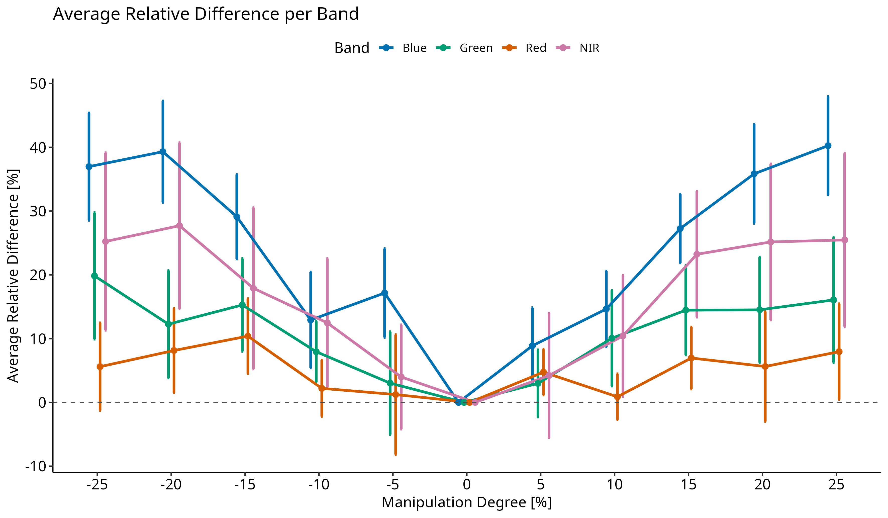
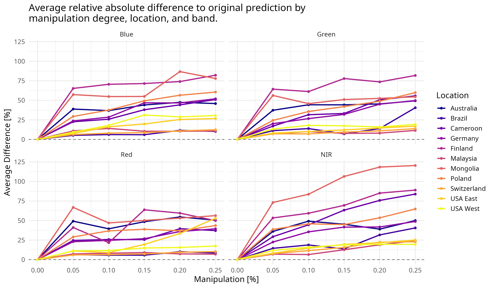
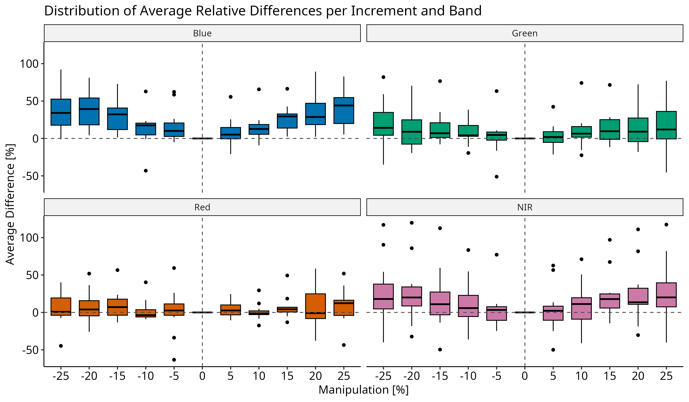
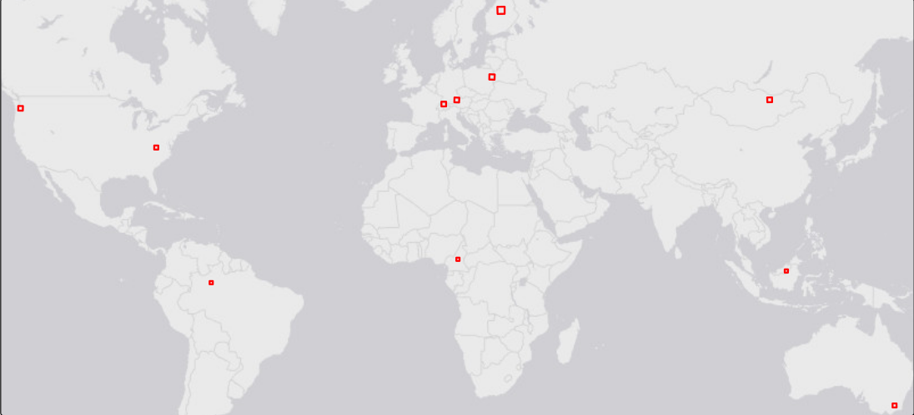

# Canopy height mapping from optical remote sensing data: reassessing deep learning methods

## Experimental exploration of the GCHM by [Nico Lang](https://langnico.github.io/globalcanopyheight)

This repository tracks the exploration of the Model presented in [A high-resolution canopy height model of the Earth](https://arxiv.org/abs/2204.08322).
**Goal** of this work is to understand how the model works and predicts, if any ecological relationships between spectral data and canopy height can be identified and how the model reacts to changes in input data.
For a full explanation of the installation, setup and deployment see the original instructions: [Installation](https://github.com/langnico/global-canopy-height-model#installation-and-credentials).

**Status: 07.10.25**

## Table of Contents

1.  [Results](#results)
2.  [Workflow](#workflow)
    -   [2.1 Working Time](#working-time)
    -   [2.2 Tiles](#tiles)
    -   [2.3 Calculation groups](#calculation-groups)
    -   [2.4 Prediction comparison](#prediction-comparison)
3.  [Setup Notes](#setup-notes)
4.  [Citation](https://github.com/ESA99/canopy_height#citation)

## Results

The following plot shows the results of the "America" Tiles (see section [Calculation Groups](#calculation-groups)), comparing the differrence to the original prediction when manipulating single bands of the input by up to 25%.
The x-axis shows the degree of manipulation applied to each spectral band, expressed as a percentage (e.g., +10% indicates *Band × 1.10*).
The y-axis represents the resulting average change in the predicted variable (in meters).
Multiple spectral bands are visualized, color-coded similar to their conventional band colors (but in a colour blind freindly way), allowing comparison across different tile locations.  


Overview of the average relative difference by band.


One sided plot, showing the average relative difference to original prediction per tile and band.


Boxplot overview of average relative difference per band by manipulation degree.


## Workflow

The deploy.R script contains the full workflow and is deployed from bash after setting the correct conda environment and directory.
At the beginning Tile-Name, Bands, Increment and direction are Set and then the script is deployed.
The original code (deploy.py etc.) was modified to fit the script as well as extended by a manipulation-function performing the band manipulation inside the deployment.
The original (pretrained) models and all other code are used unchanged.

Functions from the package "dandelion" (<https://github.com/ESA99/dandelion>) were used and written specifically for the usecase of this modified deployment.

#### Working Time

The following timing values correspond to the model deployment on the ILÖK-RS Supercomputer.
Each loop represents a single combination of tile, band, and increment.

| Loops | Total [h] | Average [min] | Tile Group |
|:-----:|:---------:|:-------------:|:----------:|
|  27   |   04:49   |     10:43     |            |
|  99   |   20:15   |     12:16     |            |
|  123  |   24:11   |     11:48     |  Americas  |
|  246  |   75:45   |     18:29     | EuAfMalasia   |

### Tiles

The selection process is being coordinated in consultation with the University of Munich.
Corresponding Worldcover as tiles are needed, and were cropped accordinlgy.



**Selection:** 3 Tiles presented in the paper + 1 Demo Tile from the Paper + 3 Tiles in Europe for management comparison + 4 tiles spread globally to ensure latitudinal variance and global coverage (+ Biome Diversity).
Mongolia: Old selection 50TPT, new proposal by Lukas **49UCP**.

| Continent | Latitude | Name | Country | Biome | Centeroid_Elevation | Source |
|----------|:--------:|:--------:|----------|--------------|:--------:|----------|
| Africa | 5.8 | 33NTG | Cameroon | Tropical Moist Broadleaf | 754 | PAPER |
| Asia | 47.3 | 49UCP | Mongolia | Temp. Grasslands + Temp. Conifer | 902 | Munich |
| Asia | 2.2 | 49NHC | Malaysia | Tropical Moist Broadleaf | 401 | PAPER |
| Europe | 47.4 | 32TMT | Switzerland | Temp. Coniferous + Broadleaf | 590 | PAPER |
| Europe | 48.2 | 32UQU | Germany | Temp. Broadleaf + Coniferous | 422 | Munich |
| Europe | 52.7 | 34UFD | Poland | Temp. Broadleaf | 154 | Munich |
| Europe | 63.5 | 35VML | Finland | Boreal Forest | 201 | Münster |
| North America | 46.5 | 10TES | USA West| Temp. Broadleaf Forest | 392 | PAPER |
| North America | 37.5 | 17SNB | USA East | Temp. Broadleaf Forest | 682 | BOTH |
| Oceania | -36.6 | 55HEV | Australia | Temp. Broadleaf + Montane Grass/Shrub | 562 | Münster |
| South America | -1.4 | 20MMD | Brazil | Trop. Moist Broadleaf | 56 | Münster |

#### Calculation groups

Tiles will be "grouped" for the analysis in three deployment groups, to split calculation time in blocks and allow for more efficient workflow.
1.
Americas (10TES, 17SNB, 20MMD) 2.
Europe (32TMT, 32UQU, 34UFD, 35VML) 3.
AfAsOc (33NTG, 49NHC, 49UCP, 55HEV)

### Prediction comparison

Analysis of different calculation techniques to compare if prediction results differ.
Original-result-tile vs. Single-Tile-deployment vs. Multi-Tile-deployment (5-10).


## Setup Notes

The installation was performed generally following option **B** of the [Installation Instructions](https://github.com/langnico/global-canopy-height-model/blob/main/INSTALL.md).

**miniforge3** replaces the outdated mambaforge. The command **conda** has to be used instead of mamba at some steps (Step 5 was a problem for example).
There may be some dependencies not installed, check for those if an error occurs -> Ex.: libtiff 5 was required but there where four different versions, resulting in an error when deploying the demo script.

### Usefull code

This code sets up to treat a folder (for example gchm) as a python package after looking for setup.py
``` bash
pip install -e .
```

Real time GPU supervision:
``` bash
watch -n 1 nvidia-smi
```

## Citation

This work is based on the paper and repository by Lang, N., Jetz, W., Schindler, K., & Wegner, J. D.
(2023).
A high-resolution canopy height model of the Earth.
Nature Ecology & Evolution, 1-12.

```         
@article{lang2023high,
  title={A high-resolution canopy height model of the Earth},
  author={Lang, Nico and Jetz, Walter and Schindler, Konrad and Wegner, Jan Dirk},
  journal={Nature Ecology \& Evolution},
  pages={1--12},
  year={2023},
  publisher={Nature Publishing Group UK London}
}
```
