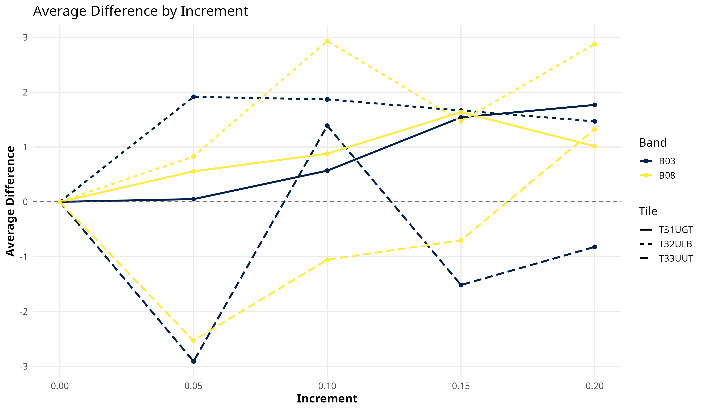

# Experimental exploration of the GCHM by [Nico Lang](https://langnico.github.io/globalcanopyheight)

This repository tracks the exploration of the Model presented in [A high-resolution canopy height model of the Earth](https://arxiv.org/abs/2204.08322). **Goal** of this work is to understand how the model works and predicts, if any ecological relationships between spectral data and canopy height can be identified and how the model reacts to changes in input data.
For a full explanation of the installation, setup and deployment see the original instructions: [Installation](https://github.com/langnico/global-canopy-height-model#installation-and-credentials).


## Table of Contents
1. [Results](#results)
2. [Workflow](#workflow)
   - [2.1 Working Time](#working-time)
   - [2.2 Tiles](#tiles)
4. [Citation](https://github.com/ESA99/canopy_height#citation)

## Results
The following plot presents an initial demonstration of the approach used to assess the sensitivity of prediction outputs to spectral band manipulation. Although not based on the final dataset, it illustrates the method applied to a subset of tiles. The x-axis shows the degree of manipulation applied to each spectral band, expressed as a percentage (e.g., +10% indicates Band × 1.10). The y-axis represents the resulting average change in the predicted variable (in meters). Multiple spectral bands are visualized, color-coded according to their conventional band colors, allowing comparison across different tile locations. Colour blind friendly alternatives are available.


Following is the first example plot illustrating the impact of band value modifications on prediction outcomes. The x-axis represents the relative increment applied to each spectral band (e.g., 0.05 corresponds to a 5% increase: Band × 1.05), while the y-axis shows the average change in prediction values, measured in meters. Positive values indicate an increase in the predicted variable, and negative values indicate a decrease.




## Workflow
The deploy.R script contains the full workflow and is deployed from bash after setting the correct conda environment and directory.
At the beginning Tile-Name, Bands, Increment and direction are Set and then the script is deployed. The original code (deploy.py etc.) were modified to fit the script.

Fuctions from the package "dandelion" (https://github.com/ESA99/dandelion) were used and written specifically for this usecase.

#### Working Time
The following timing values correspond to the model deployment on the ILÖK-RS Supercomputer. Each loop represents a single combination of tile, band, and increment. Note that parallel processing has not yet been implemented.

| Loops | Total [h] | Average [min] |
|:----------:|:----------:|:----------:|
| 27 | 04:49 | 10:43 |
| 99 | 20:15 | 12:16 |


### Tiles
The selection process is being coordinated in consultation with the University of Munich.

Corresponding Worldcover as tiles are needed!

|Continent     | Latitude|Name  |Country                          | Biome | Centeroid_Elevation|Source | Selection |
|:-------------:|:--------:|:-----:|:--------------------------------|:------------|:-------------------:|:------:|:----:|
|Africa        |     33.8|30SUC |Morocco                          | Mediterranean Forest + Montane            |                894|MU     | (X) |
|Africa        |    -13.2|34LCL |Angola                           | Subtropical Grasslands, Savannas          |               1449|MU     | X |
|Africa        |     -4.1|34MCA |Democratic Republic of the Congo | (SubTrop.) Moist Broadleaf + Grass/Shrub  |                366|MS     | |
|Africa        |    -21.3|38KQB |Madagascar                       | Moist Broadleaf Forests, mountains        |                775|MU     | |
|Asia          |     26.6|47RMK |Myanmar                          | Trop. Moist Broadlwaf + Temperate Conifer |               2443|MU     | |
|Asia          |     14.0|48PXA |Cambodia                         | Tropical Dry Broadleaf                    |                109|MS     | |
|Asia          |      1.3|49NHB |Indonesia                        | Tropical Moist Broadleaf                  |                780|MU     | |
|Asia          |     47.4|50TNT |Mongolia                         | Temperate Grasslands + Temperate Conifer  |                687|MU     | 50TPT |
|Asia          |     -5.9|54MTU |Indonesia                        | Tropic. Moist Broadlwaf + Mangroves       |                 26|MS     | X |
|Europe        |     47.4|32TMT |Switzerland                      | Temp. Broadleaf Coniferous + Broadleaf    |                590|BOTH   | X |
|Europe        |     48.2|32UQU |Germany                          | Temperate Broadleaf + Coniferous          |                422|MU     | |
|Europe        |     63.5|35VML |Finland                          | Boreal Forest                             |                201|MS     | X |
|North America |     50.0|10UFA |Canada                           | Temperate Coniferous                      |                751|MS     | X |
|North America |     47.4|11TNN |United States of America         | Temperate Coniferous                      |               1092|MU     | |
|North America |     37.5|17SNB |United States of America         | Tempered Broadleaf                        |                682|BOTH   | X |
|Oceania       |    -13.2|52LFL |Australia                        | Subtropical Grasslands, Savannas          |                  8|MU     | |
|Oceania       |    -36.6|55HEV |Australia                        | Temp. Broadleaf + Montane Grass/Shrub     |                562|MS     | X |
|South America |    -16.8|19KGB |Bolivia                          | Trop. Moist Broadleaf + Montane Grasslands|               3888|MU     | |
|South America |     -1.4|20MMD |Brazil                           | Trop. Moist Broadleaf                     |                 56|MS     | |
|South America |     -4.1|21MYR |Brazil                           | Trop. Moist Broadleaf                     |                147|MU     | X |


## Citation

This work is based on the paper and repository by
Lang, N., Jetz, W., Schindler, K., & Wegner, J. D. (2023). A high-resolution canopy height model of the Earth. Nature Ecology & Evolution, 1-12.
```
@article{lang2023high,
  title={A high-resolution canopy height model of the Earth},
  author={Lang, Nico and Jetz, Walter and Schindler, Konrad and Wegner, Jan Dirk},
  journal={Nature Ecology \& Evolution},
  pages={1--12},
  year={2023},
  publisher={Nature Publishing Group UK London}
}
```

